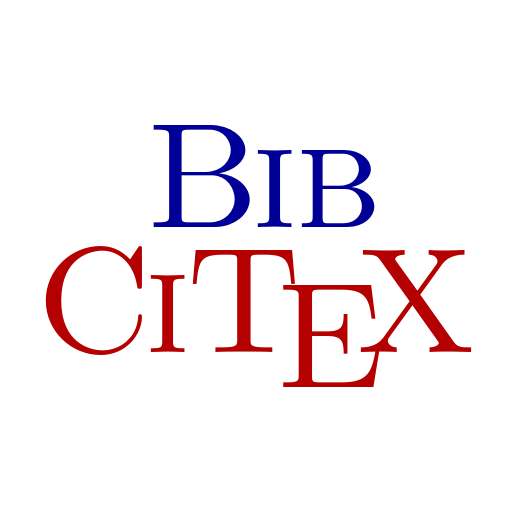

# 👋 Hello, I'm @tangxiangong

## 🔭 Main Projects

<h3><a href="https://github.com/tangxiangong/diffusionx">DiffusionX</a></h3>

High-performance stochastic process simulation library, focusing on numerical simulation of diffusion processes.

**Key Features**:
- Random number generation: Normal distribution, Uniform distribution, Exponential distribution, Poisson distribution, α-stable distribution
- Stochastic processes: Brownian motion, α-stable Lévy process, Fractional Brownian motion, Poisson process, etc.
- Feature-based extensible design, easy to add new stochastic processes
- Visualization of stochastic processes using [plotters](https://github.com/plotters-rs/plotters)

<h3></h3>

BibTeX reference citation tool built with Rust and Dioxus, providing quick citation access and cross-application paste functionality.

**Key Features**:
- One-click citation copying for seamless workflow integration
- Cross-application paste support
- Support for multiple BibTeX entry types (Article, Book, Thesis, InBook, InCollection, Misc, TechReport, InProceedings, etc.)
- Smart search and filtering capabilities
- Available for macOS (Apple Silicon & Intel) and Windows (ARM64 & x86_64)

## 📊 GitHub Stats

## 📫 Contact

  
  

